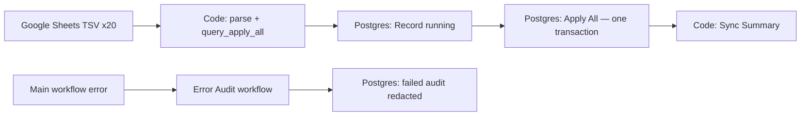

# Structured Sync Safety P0 — Local Report

Date: 2026-08-10  
Tasks: `WHIEDA_COMPOSER_STRUCTURED_SYNC_SAFETY_P0_TASK_V1_2026-08-10.md` (`e52a3c2`) + review fixes `WHIEDA_DROVOSEK_STRUCTURED_SYNC_SAFETY_P0_REVIEW_FIXES_V1_2026-08-10.md` (`4f7bce7`)  
**Status: `local_verified` / `live_not_deployed`**

Scope: local artifacts only — **no production, n8n UI, Google Sheets, or live publish executed.**

Conversation Reliability Lab (`qa/conversation_reliability/`, commit `b775f6c`) was **not modified**.

---

## Review fixes applied (4f7bce7)

### P0-1 — Error Trigger binds to original execution

- Error handler reads `payload.execution.id` (failed main execution), **not** `$('Code: Build Structured Sync SQL')` and **not** error-workflow `$execution.id`.
- `UPDATE … WHERE workflow_execution_id = <original> AND status = 'running'` — one running row becomes one failed row (same `sync_run_uuid`).
- Fallback insert only when no matching running row; marked `error_metadata.unmatched_error_trigger = true`.
- Non–WHIEDA-sync workflow ids → `skip_failed_audit: true`, no audit write.
- Integration test uses `qa/structured_sync/fixtures/n8n_error_trigger_payload.json`.

### P0-2 — Inert workflow patches + dry-run deploy helper

- Patch JSON exports: `"active": false`.
- Main artifact: `settings.errorWorkflow = "__WHIEDA_SYNC_ERROR_WORKFLOW_ID__"` (placeholder only).
- `prepare_whieda_structured_sync_safety_deploy_2026-08-10.py` — dry-run by default; `--apply` saves workflows **inactive** with real error-workflow id wired in.
- No cron change, no sync trigger, no docker restart, no Sheet write.

---

## Architecture

### Before


- Each layer = separate Postgres node → partial catalogue on mid-chain failure.
- Audit wrote `success` only, after all nodes; no `running` / `failed`.
- P0 circuit breaker in Code node stopped empty critical TSV before writes (kept).

### After (local patch)



- `BEGIN → advisory lock (whieda) → all layer replacements + partners → audit success → COMMIT`.
- Second concurrent run fails at lock before any structured write.
- Error Trigger workflow: payload-driven failed audit; IF gate skips non-WHIEDA failures.

---

## Deliverables

| Deliverable | Artifact |
|-------------|----------|
| A — atomic apply | `query_apply_all` in `n8n/current/whieda_structured_sync_code_2026-07-13.js` |
| B — audit journal | `n8n/patches/advisor_structured_sync_runs_v2_2026-08-10.sql`, error workflow JSON |
| C — freshness contract | `n8n/current/structured_sync_health_2026-08-10.py`, `n8n/patches/STRUCTURED_SYNC_FRESHNESS_API_SHAPE_V1.md` |

---

## Test commands and results

### Unit tests (always)

```powershell
cd D:\Projects\WHIEDA\backend\platform-api
python -m pytest tests/test_structured_sync_safety.py -q
```

**Result:** `15 passed`

### Full local lab (Docker staging)

```powershell
cd D:\Projects\WHIEDA
python qa/structured_sync/run_structured_sync_safety.py
```

**Result:** `STRUCTURED_SYNC_SAFETY_P0: PASS`

| Case | Result |
|------|--------|
| Valid corpus → one `success` audit | PASS |
| Empty critical layer → no write, `failed` audit | PASS |
| Mid-layer failure → rollback, `failed` audit | PASS |
| Parallel runs → lock blocks contender | PASS |
| Secret redaction in audit | PASS |
| Freshness: healthy / stale / failed / never_synced | PASS |
| Error Trigger: running → failed (same uuid + exec id) | PASS |
| Error Trigger: foreign workflow → no audit | PASS |
| Deploy dry-run: artifacts `active=false` | PASS |

### Offline-only (no Docker)

```powershell
python qa/structured_sync/run_structured_sync_safety.py --offline
```

**Result:** pytest PASS, Docker NOT_RUN

### Row counts — failure tests (Docker run 2026-08-10)

| Scenario | products before | products after | audit failed |
|----------|-----------------|----------------|--------------|
| Empty critical layer (circuit breaker) | 3 | 3 | yes |
| Mid-transaction `1/0` | 5 | 5 | yes |
| Parallel lock contender | 2 | 2 | yes (lock busy) |
| Valid corpus control | 3 | 1 (replaced corpus) | no (`success`) |

---

## Production / live touch proof

- No SSH to `185.252.232.93`
- No `publish_and_run_whieda_sync_2026-07-13.py` execution
- No Google Sheets or n8n UI changes
- No Telegram / Dify / site edits
- Artifacts are repo-local under `n8n/current`, `n8n/patches`, `qa/structured_sync`

---

## Controlled live rollout (2026-08-10)

Safety P0 was applied to the live structured-sync workflow after a local backup and
the idempotent `advisor_structured_sync_runs_v2` migration. The first controlled
run exposed an n8n expression rendering issue in a dollar-quoted SQL block; the
main workflow was immediately restored from backup and the old sync completed
successfully. The lock was then changed to `SET LOCAL lock_timeout` plus
`pg_advisory_xact_lock`, avoiding dollar-quoted SQL in n8n entirely.

The corrected workflow was deployed and one controlled webhook run completed:

- workflow execution: `15257`;
- audit status: `success`;
- run time: `2026-08-10 12:37:16Z` to `12:37:17Z`;
- main workflow and linked Error Audit workflow: active.

Post-run row-count reconciliation against the captured 20-layer master snapshot:

- all 19 runtime-backed layers matched;
- aliases are `120` master rows and `118` runtime rows because the master contains
  two known duplicate alias rows, while runtime retains unique aliases;
- no critical layer was empty or reduced below its floor;
- `partners_ref` was not reconciled here because it uses the separate lead tables.

The old generic parity script still reports hash mismatches: it hashes master by
key fields but runtime by key plus display fields. That script is not evidence of
runtime drift until its hash contract is aligned; the controlled release check used
the authoritative row-count reconciliation above.

---

## Changed files

**Modified**

- `n8n/current/whieda_structured_sync_code_2026-07-13.js` — `query_apply_all`, running audit, lock, P0 breaker retained
- `n8n/current/whieda_structured_sync_workflow_safety_p0.py` — inert artifacts, payload-based error handler, IF gate
- `n8n/current/publish_and_run_whieda_sync_2026-07-13.py` — uses safety P0 workflow builder

**Added**

- `n8n/current/whieda_structured_sync_safety_lib.py`
- `n8n/current/prepare_whieda_structured_sync_safety_deploy_2026-08-10.py`
- `n8n/current/structured_sync_health_2026-08-10.py`
- `n8n/patches/advisor_structured_sync_runs_v2_2026-08-10.sql` (+ `error_metadata jsonb`)
- `n8n/patches/whieda_structured_sync_safety_p0_workflow.json` (`active: false`)
- `n8n/patches/whieda_structured_sync_error_audit_workflow.json` (`active: false`)
- `qa/structured_sync/fixtures/n8n_error_trigger_payload.json`
- `n8n/patches/STRUCTURED_SYNC_FRESHNESS_API_SHAPE_V1.md`
- `qa/structured_sync/fixture_builder.py`
- `qa/structured_sync/harness.py`
- `qa/structured_sync/run_structured_sync_safety.py`
- `backend/platform-api/tests/test_structured_sync_safety.py`
- `STRUCTURED_SYNC_SAFETY_P0_LOCAL_REPORT.md`

---

## Remaining release step (architect-controlled)

1. Review patch JSON + deploy helper dry-run output.
2. Run `prepare_whieda_structured_sync_safety_deploy_2026-08-10.py --apply` only after sign-off (workflows stay inactive until manual activate).
3. Activate Error Audit workflow, then main workflow; trigger one controlled sync.
4. Confirm audit `running → success` or `running → failed` with matching execution id.

---

## Health probe (local)

```powershell
python n8n/current/structured_sync_health_2026-08-10.py
```

Uses read-only SELECT against `advisor_structured_sync_runs` and structured row counts; returns `healthy|stale|failed|never_synced`.

## Deploy helper (dry-run)

```powershell
python n8n/current/prepare_whieda_structured_sync_safety_deploy_2026-08-10.py
python n8n/current/prepare_whieda_structured_sync_safety_deploy_2026-08-10.py --apply  # architect only
```

### Deploy guard fix (`WHIEDA_DROVOSEK_STRUCTURED_SYNC_SAFETY_P0_DEPLOY_GUARD_FIX_V1_2026-08-10.md`)

- Reads **prior main `active`** before any write.
- Saves both workflows inactive, then **restores main `active=true`** only if it was active before apply.
- Activates Error Audit **only after** `settings.errorWorkflow` is verified on main.
- On failure: restores main backup, deactivates error if it was activated; exit code `1` with `rollback` in JSON report.
- Dry-run: **no network** (`network: not_used`).
