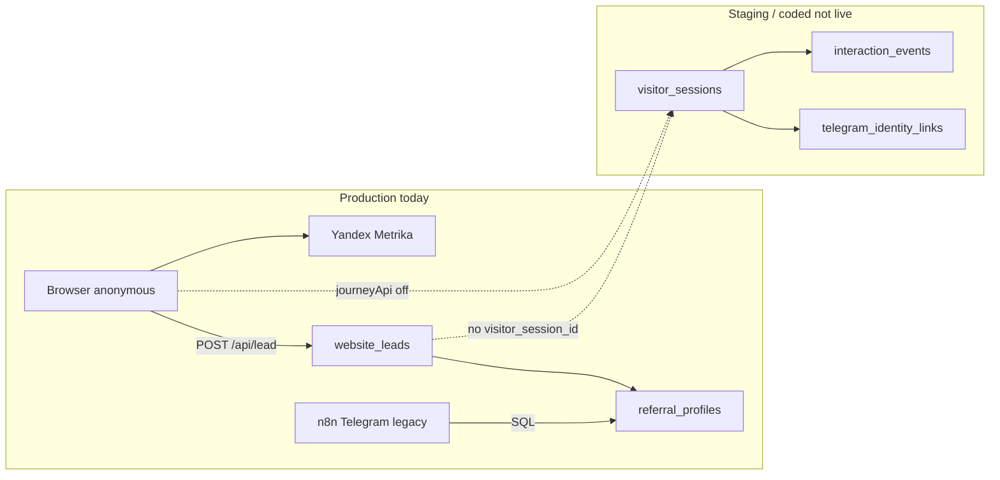

# WWC Owner Cabinet — карта данных V1

**Дата:** 2026-08-09  
**Этап:** P0.0 (инвентаризация, без UI и без изменений production)  
**Иерархия:** `00_READ_FIRST_WHIEDA_CANON.md` → `WHIEDA_PLATFORM_MASTER_PROGRAM_SPEC_V1_2026-08-09.md` → `WWC_OWNER_CABINET_SPEC_V0_1_2026-08-09.md`  
**Статус:** только фактически найденные источники; `gap` — не выдумано.

## 1. Легенда состояний

| Метка | Значение |
|-------|----------|
| `production` | Подтверждено live или активно используется публичным контуром (`WHIEDA_LIVE_STATUS.md`, nginx, site build) |
| `staging` | DDL/код есть; применяется на local Docker Postgres `:55432` и/или `/opt/whieda-platform-staging` (`:8081`) |
| `local` | Только local core lab / pytest / E2E fixtures |
| `fixture` | Шаблоны и seed-файлы без live editor |
| `plan` | Описано в спеках; реализации или writers нет |

## 2. Сводная схема потоков (факт)

```text
Google Sheets (editor, не читается браузером кабинета)
  ├─ Partners_Ref (gid 1733124410) ──15-min n8n cron──► referral_profiles, lead_actors
  ├─ Products/aliases/cards/… (structured tabs) ──cron──► advisor_structured_* (Postgres)
  ├─ Users_Access (structured) ──cron──► advisor_structured_users_access
  └─ WWC markets tabs (5) ──CLI/scheduler──► wwc_* (Postgres)   [editor ещё не подключён live]

Site wwc.best
  ├─ static products.js ──build──► каталог (цены на сайте)
  ├─ Yandex Metrika 111158320 ──► внешняя аналитика (ref_visit, lead_*, advisor_*)
  └─ journey client (journeyApi=off) ──► visitor_sessions, interaction_events  [не пишет в prod]

Platform API (Core)
  ├─ POST /api/v1/leads ──► website_leads + outbox
  ├─ GET /api/v1/public/ref/{code} ──► referral_profiles
  └─ GET /api/catalog-prices, /api/site-context, … ──► wwc_*  [flag market_centers_v1=false на сайте]

Telegram
  └─ legacy n8n webhook advisor-whieda-v0 ──► SQL advisor + Sheets reads  [CORE_ROUTE_TELEGRAM=legacy]
```

---

## 3. Реестр сущностей

### 3.1. Заявки (leads)

| Поле | Значение |
|------|----------|
| **Источник истины (runtime)** | Postgres `website_leads` + связанные таблицы |
| **Editor** | Нет прямого UI; статус меняется через Telegram/n8n review flow (не кабинет) |
| **Таблицы** | `website_leads`, `website_lead_status_history`, `website_lead_owner_history`, `website_lead_watchers`, `lead_delivery_attempts` |
| **Ключевые колонки** | `public_id`, `status` (`new/contacted/qualified/won/lost/spam`), `delivery_status`, `name`, `contact`, `product_name`, `product_sku`, `initial_ref_code`, `first_ref_code`, `active_ref_code`, `attributed_owner_id`, `assigned_owner_id`, `country_code`, `city`, `service_location_id`, `metadata` (jsonb: `visitor_session_id`, `market_id`, `center_id`, …), `idempotency_key`, `consent_*` |
| **Кто читает** | Core `app/leads/service.py`; n8n `whieda-lead-delivery-v1`; smoke-скрипты; `build_leader_digest` (count only) |
| **Кто пишет** | Core POST `/v1/leads` / `/api/v1/leads`; n8n/Telegram — status/owner через legacy SQL (не Core admin API) |
| **API** | `POST /api/v1/leads` (production ingest, `CORE_ROUTE_LEADS=core`); **нет** `GET` list/detail для кабинета |
| **Состояние** | `production` (ingest + delivery); расширенные колонки P0.1 — `staging`/live DB additive migration |
| **Дубли/противоречия** | Legacy workflow `wwc_website_lead_v1` дублирует routing SQL в n8n vs Core `leads/service.py`; site `leadApi: legacy` шлёт на `/api/lead`, nginx проксирует на Core — endpoint разный, backend один |
| **Недостающие поля для кабинета** | Единый `GET` с фильтрами; маскирование `contact`; явные роли «привёл / обрабатывает / watchers» в одном JSON; ссылка на Telegram thread; `market_id`/`center_id` в top-level (сейчас частично в `metadata`); `last_activity_at`; audit-safe export |

### 3.2. Партнёры, ref, профили

| Поле | Значение |
|------|----------|
| **Editor (operational)** | Google Sheet `Partners_Ref`, spreadsheet `1Lm6ucw1oo0HQjvN2ZuxIGs2vK1lehw93jwqff7ldbz4`, gid `1733124410` |
| **Runtime** | Postgres `referral_profiles`, `lead_actors`, `lead_actor_roles` |
| **Sync** | n8n `WHIEDA Structured Sync Cron` → `query_partners_runtime` (`whieda_structured_sync_code_2026-07-13.js`); также `run_partners_ref_runtime_sync_2026-08-01.py` |
| **Колонки referral_profiles** | `ref_code`, `owner_id`→`lead_actors`, `display_mode` (`anonymous`/`named`), `public_profile` (jsonb: имя, фото, контакты), `country_code`, `region_code`, `enabled`, `profile_version`, `publication_consent_at` |
| **Кто читает** | Core `GET /v1/public/ref/{code}`; site `ReferralBootstrap`; n8n lead routing SQL |
| **Кто пишет** | Только sync из Sheets → Postgres; admin upsert API **удалён** (`publish_whieda_public_ref_api_readonly_2026-08-02.py`) |
| **API** | `GET /api/v1/public/ref/{code}` — публичный профиль (`CORE_ROUTE_PUBLIC_REF=core`) |
| **Состояние** | `production` (Sheets editor + Postgres runtime + public ref API) |
| **Дубли** | `wwc_ref_structures` (markets) мапит ref→`structure_id` отдельно от `referral_profiles`; нет единой master-таблицы `structures` |
| **Недостающие для кабинета** | Admin list/search; `last_activity_at`; тариф/уровень (`Structure Basic` / `Partner PRO` / `Leader Platform`) — **gap** (см. §3.3); QR URL; публичная ссылка как computed field; deep link в строку Sheets |

### 3.3. Пользователи Telegram и роли

| Поле | Значение |
|------|----------|
| **Telegram runtime (bot)** | Legacy n8n → Postgres `advisor_structured_users_access` (sync из Sheets tab Users_Access) + прямые SQL в workflow |
| **Leads/partners runtime** | `lead_actors` (`telegram_chat_id`, `telegram_username`), `lead_actor_roles` (`platform_owner`, `tenant_admin`, `market_admin`, `referral_owner`, `lead_watcher`) |
| **Identity bridge (Core)** | `telegram_identity_links`, `identity_link_tokens`, `visitor_sessions` — код готов, live Telegram `legacy` |
| **Кто читает** | n8n advisor workflow; Core identity/onboarding (staging); smoke scripts |
| **Кто пишет** | Structured sync (users_access); seed migrations; Core exchange endpoint (staging) |
| **API** | `POST /v1/telegram-link-tokens`, `POST /v1/telegram-link-tokens/exchange`; **нет** admin user list |
| **Состояние** | Bot path: `production` (legacy); Core identity: `staging`/`local`; `telegramLinkApi: off` на сайте |
| **Дубли** | Два реестра Telegram-пользователей: `lead_actors` (partners/leads) vs `advisor_structured_users_access` (bot access/subscription_status) — разные схемы, нет FK |
| **Недостающие для кабинета** | Единая карточка человека; mapping Telegram ID ↔ lead_actors; product tier; admin allow-list table; `super_admin`/`admin`/`viewer` — **plan** (кабинет spec §2) |

### 3.4. Структуры (structure)

| Поле | Значение |
|------|----------|
| **Источник истины** | **gap** — нет таблицы `structures` |
| **Фактические носители** | `wwc_ref_structures.structure_id` (text); `advisor_structured_structure_owners.structure_code`; `advisor_structured_users_access.structure_code`; поля в Sheets |
| **Кто читает** | Markets API (`resolve_structure_id`); advisor SQL |
| **Состояние** | `staging` (wwc mapping); advisor tables `production` в bot DB |
| **Недостающие** | Canonical structure registry; display name; leader; история изменений; фильтр кабинета «по структуре» |

### 3.5. Рынки (markets)

| Поле | Значение |
|------|----------|
| **Editor (целевой)** | Google Sheet tabs: `markets`, `ref_structures`, `product_prices`, `service_centers`, `service_center_coverage` (шаблон: `backend/platform-api/data/wwc_markets_sheets_template/`) |
| **Runtime** | Postgres `wwc_markets`, `wwc_markets_sync_registry`, staging tables `wwc_*_staging` |
| **Кто читает** | Core `GET /v1/site-context`, `/v1/catalog-prices`, `/v1/service-centers`, … |
| **Кто пишет** | `run_markets_sync()` — CLI `scripts/sync_wwc_markets.py` или scheduler; режим `fixture` или `google` |
| **API** | Public read-only GETs; **нет** HTTP trigger sync для admin |
| **Состояние** | `staging`/`local` (fixtures + tests 390/390); **не** production (`market_centers_v1: false`, site `siteApi: null`) |
| **Дубли** | Site static `products.js` vs `wwc_product_prices` vs `advisor_structured_products.retail_price_*` |
| **Недостающие для кабинета** | Snapshot status в admin overview; список рынков с `synced_at`; human-readable sync errors из `wwc_markets_sync_registry.last_error` |

### 3.6. Цены (prices)

| Поле | Значение |
|------|----------|
| **Production display** | Site build `03_Website/wwc-best/src/data/products.js` — `retailRub`, `retailByn`, `pv` (36 SKU) |
| **Staging runtime** | `wwc_product_prices` (`sku`, `market_id`, `currency_code`, `amount`, `price_state`, `is_active`, `updated_at`) |
| **Advisor runtime** | `advisor_structured_products` — RUB/BYN/W columns, sync из Products sheet |
| **Legacy sheet** | n8n читает Products tabs в structured sync |
| **API** | `GET /api/catalog-prices?market_id=&sku=` (Core, staging-ready); site **не** вызывает (flag off) |
| **Состояние** | Site prices: `production`; wwc_product_prices: `staging`/`fixture`; advisor products: `production` (bot SQL) |
| **Дубли** | Три независимых price source; расхождение возможно без sync |
| **Недостающие для кабинета** | Admin paginated prices; `price_state` + marker «не опубликовано»; product display name join (SKU→name из products.js или отдельный catalog table — **gap**) |

### 3.7. Сервисные центры

| Поле | Значение |
|------|----------|
| **WWC model (новый)** | `wwc_service_centers`, `wwc_service_center_coverage` — полный профиль центра (фото, maps, manager, …) |
| **Legacy lead routing** | `service_locations` — город/оператор для заявок (`website_leads.service_location_id`) |
| **API** | `GET /v1/service-centers`, `/v1/service-center-cities` (Core, staging) |
| **Состояние** | wwc_*: `staging`/`fixture`; service_locations: `production` (leads) |
| **Дубли** | Две модели «центра» с разными полями и назначением |
| **Недостающие для кабинета** | Completeness score (обязательные поля); «города без покрытия»; join center↔structure; не смешивать с `service_locations` в UI без явной пометки |

### 3.8. Статусы заявок и delivery

| Поле | Значение |
|------|----------|
| **Таблицы** | `website_leads.status`, `website_leads.delivery_status`, `website_lead_status_history`, `lead_delivery_attempts` |
| **Writer** | n8n/Telegram review; Core только create + outbox `lead_created` |
| **Состояние** | `production` |
| **Недостающие** | Admin read history timeline; безопасное изменение статуса (P1); единый статус для Telegram и кабинета — **plan** (cabinet spec §3.2) |

### 3.9. Подписки, entitlements, лимиты, расходы

| Поле | Значение |
|------|----------|
| **tenant_entitlements** | Feature flags (`structure_basic`, `partner_leads`) — **production** schema, не billing tier |
| **tenant_usage_ledger** | DDL exists (`platform_tenant_registry_v1.sql`); writers **gap** |
| **advisor_structured_users_access** | `subscription_status` (`off`, …) — bot access sheet mirror |
| **Product tiers** | Structure Basic / Partner PRO / Leader Platform — **plan** (canon + master spec § тарифы) |
| **События usage** | Каталог §5.9 — **plan** |
| **Недостающие для кabinet** | Весь блок «Доступ и расходы» — показывать `gap`, не нули |

### 3.10. Синхронизация реестров

| Реестр | Механизм | Статус API | Состояние |
|--------|----------|------------|-----------|
| Partners_Ref | n8n cron 15 min | **gap** | `production` sync |
| Structured products/advisor | n8n cron | **gap** | `production` |
| WWC markets/prices/centers | Core `run_markets_sync` + registry | `wwc_markets_sync_registry` readable только SQL/CLI | `staging` |
| Lead delivery | Core outbox → n8n | outbox internal | `production` |

**Недостающие для экрана «Источники и синхронизация»:** unified `GET /v1/admin/sync-status` aggregating partners cron (last run from n8n execution — **not in Core today**), markets registry, row counts accepted/rejected.

### 3.11. Admin auth / cabinet users

| Поле | Значение |
|------|----------|
| **Состояние** | **plan** — нет таблиц admin session, allow-list, audit |
| **Задумано** | Telegram link-token + allow-list Telegram user IDs (cabinet spec §2) |

---

## 4. События: факт vs генеральное ТЗ §7

Сопоставление с `WHIEDA_PLATFORM_MASTER_PROGRAM_SPEC_V1_2026-08-09.md` §7 и `WHIEDA_DATA_COLLECTION_ANALYTICS_CATALOG_V1_2026-08-09.md`.

### 4.1. Три канала сбора (факт)

| Канал | Хранилище | Production writers | Состояние |
|-------|-----------|-------------------|-----------|
| Yandex Metrika | Yandex cloud | Site `wwc-metrika-events.js` | `verified_production` |
| Platform Core journey | `interaction_events`, `visitor_sessions` | Site `journey.js` при `journeyApi≠off` | **off** (`journeyApi: off`) |
| Legacy lead events | `website_events` | **нет writers** | DDL only (`plan`/dead) |

### 4.2. Metrika goals (production)

Источник: `03_Website/wwc-best/docs/ANALYTICS-PRIVACY-MAP.md`.

| Goal | Master §7 группа | Статус |
|------|------------------|--------|
| `ref_visit`, `ref_resolved`, `ref_invalid` | Вход и навигация / ref | `verified_production` |
| `ref_cta_click` | Полезное действие (Telegram) | `verified_production` |
| `lead_form_start`, `lead_submit`, `lead_submit_success`, `lead_submit_error` | Заявка | `verified_production` |
| `advisor_open`, `advisor_question`, `advisor_answer`, `advisor_fallback`, `advisor_error` | Советник | `verified_production` |
| `video_open`, `pdf_open` | Вовлечённость | `verified_production` (partial coverage) |

**Не в Metrika (by design):** PII, question text, Telegram ID, `first_ref` immutability chain в Core.

### 4.3. Core interaction_events (implemented code, not production traffic)

Контракт: `PLATFORM_API_CONTRACT_V1.md` — types: `route_opened`, `product_viewed`, `useful_action_completed`, `advisor_question`, `telegram_link_created`, `telegram_opened`, `lead_created`, `partner_contacted`, `outcome_updated`.

| Master §7 требование | Core event | Metrika | Статус |
|---------------------|------------|---------|--------|
| Первое посещение | — (`visitor_first_seen` catalog) | auto pageview | `gap` in Core |
| Открытие страницы | `route_opened` | pageview | `implemented`, not `verified_production` |
| ref/кампания | session `first_ref`/`current_ref` | `ref_visit` | split channels |
| Глубина прокрутки 25–100% | catalog `scroll_depth_reached` | — | `plan` |
| Дочитал статью | catalog `article_completed` | — | `plan` |
| Видео 25–100% | partial `video_open` | `video_open` only | `plan` deep |
| Советник вопрос | `advisor_question` | `advisor_question` (length only) | Core: staging; Metrika: prod |
| Заявка | `lead_created` (if `visitor_session_id`) | `lead_submit` | **site не шлёт visitor_session_id** → Core chain broken |
| Telegram link | `telegram_link_*` | — | Core: staging; site `telegramLinkApi: off` |
| Onboarding steps | onboarding tables + commands | — | `staging`/`local` |
| Subscription/usage | catalog §5.9 | — | `plan` |

### 4.4. Pilot aggregates (staging/local)

`pilot_daily_metrics` — pre-aggregated counters by day/route_type (`route_opens`, `product_views`, `advisor_questions`, `leads_created`, …).  
Refresh: `POST /v1/pilot/refresh-metrics` (entitlement `partner_leads`).  
**Не** production traffic; полезен как прототип admin overview.

### 4.5. website_events (legacy DDL)

Типы: `visit`, `cta`, `form_start`, `submit`, `delivery`, `status_transition`.  
**Writers не найдены** в Core/site/n8n для INSERT. Treat as **deprecated/plan** — не использовать для кабинета без миграции на `interaction_events`.

---

## 5. Карта данных: аналитика именных ref

Цель: master spec §6 (посещения, конверсия, география, контент, советник, заявки, cost).

| Метрика | Источник сегодня | Достаточно для ref KPI? | Gap |
|---------|------------------|-------------------------|-----|
| **Посещения (sessions)** | Metrika (ref param); Core `visitor_sessions` if journey on | Metrika: да, без Core join; Core: staging only | Admin API агрегации по ref |
| **Уникальные посетители** | Metrika | Да, в UI Metrika | Нет в Core; нет API для кабинета |
| **Страна/регион** | Metrika geo; lead `country_code`; session context partial | Partial | `region_code` в events — plan; IP journal — plan |
| **Страницы** | Metrika; Core `route_opened` payload | Metrika prod | Core not writing |
| **Товары** | Metrika context; Core `product_viewed`; catalog slug in URL | Partial | SKU normalization across channels |
| **Статьи** | Metrika `page_type=article`; no read-depth in Core | Partial | `article_*` events — plan |
| **Видео** | Metrika `video_open` | Partial (open only) | Progress 25–100% — plan |
| **Время/глубина просмотра** | Metrika engagement; catalog `page_engaged`, `scroll_depth` | Metrika general | Core structured depth — plan |
| **Вопросы советнику** | Metrika count; advisor API logs in n8n legacy; Core `advisor_question` event | Count only | Question text intentionally not in analytics; cost attribution — gap |
| **Заявки и результаты** | `website_leads` by `first_ref_code`/`attributed_owner_id`; `pilot_outcome_events` staging | Leads: yes in DB | Outcomes not prod; no ref funnel API |
| **Стоимость использования** | — | **gap** | `tenant_usage_ledger` empty; advisor token cost not tracked |

### 5.1. Рекомендуемая staging-стратегия ref analytics (без production)

1. Enable `journeyApi` on staging host only → populate `visitor_sessions` + `interaction_events`.
2. Patch lead form to pass `visitor_session_id` on staging → close lead↔session link.
3. Compare Metrika ref goals vs Core counts for same ref/period (manual QA).
4. Build read-only ref digest query (precursor to `/v1/admin/referrals/{ref}/metrics` — **plan**).

---

## 6. Связность идентичностей (§5 задачи)

| Связь | Механизм | Работает сегодня? | Условие |
|-------|----------|-------------------|---------|
| Анонимный посетитель ↔ session | `sessionStorage` `wwc_visitor_session_id` + `PUT /visitor-sessions` | **Код да**, prod **нет** (`journeyApi: off`) | Staging flag |
| Session ↔ first_ref | `visitor_sessions.first_ref` immutable | Staging | Journey + ref bootstrap |
| Session ↔ заявка | `website_leads.metadata.visitor_session_id` + `interaction_events.lead_created` | **Нет в prod** — `leads.js` не отправляет `visitor_session_id` | Site patch + journey |
| Заявка ↔ partner/ref | `first_ref_code`, `attributed_owner_id`, `referral_profiles.owner_id` | **Да** | Production leads |
| Session ↔ Telegram | `identity_link_tokens` → `telegram_identity_links` | Staging code; prod **off** | `telegramLinkApi` + Core Telegram route |
| Telegram ↔ partner | `lead_actors.telegram_chat_id` / `advisor_structured_users_access` | Partial, **два реестра** | Manual reconciliation |
| Ref ↔ structure | `wwc_ref_structures` | Staging only | Markets sync live |
| Partner ↔ structure | `users_access.structure_code` vs `wwc_ref_structures.structure_id` | **Не нормализовано** | Canonical structure registry |

### 6.1. Identity graph (as-is)



---

## 7. Существующие read API, полезные кабинету (не admin)

| Endpoint | Данные | Admin-ready? |
|----------|--------|--------------|
| `GET /v1/reports/leader-digest` | sessions count, event_type histogram, leads count, onboarding | Partial — no pagination, no secrets filter audit |
| `GET /v1/pilot/summary` | pilot_daily_metrics | Partial — not ref-level |
| `GET /v1/public/ref/{code}` | one ref | Public only |
| `GET /v1/catalog-prices`, `/site-context`, `/service-centers` | markets | Public; no admin metadata |
| `GET /v1/memory-facts/...` | confirmed facts | Not cabinet scope P0 |

**Вывод:** все экраны кабинета P0 требуют новых `/v1/admin/*` (см. `WWC_OWNER_CABINET_API_GAPS_V1.md`).

---

## 8. Файлы-источники инвентаризации

| Область | Путь |
|---------|------|
| Leads schema | `postgres/sql/whieda_website_leads_p0_v1.sql`, `wwc_leads_p01_runtime_migration.sql` |
| Journey/events | `postgres/sql/platform_identity_journey_v1.sql` |
| Markets | `postgres/sql/platform_wwc_markets_v1.sql` |
| Tenants/entitlements | `postgres/sql/platform_tenant_registry_v1.sql` |
| API contract | `backend/platform-api/docs/PLATFORM_API_CONTRACT_V1.md` |
| Live routing | `WHIEDA_LIVE_STATUS.md` |
| Site runtime flags | `03_Website/wwc-best/public/wwc-runtime-config.json` |
| Metrika | `03_Website/wwc-best/docs/ANALYTICS-PRIVACY-MAP.md` |
| Partners sync | `n8n/current/whieda_structured_sync_code_2026-07-13.js` |
| Cabinet screens | `03_Website/wwc-best/docs/WWC_OWNER_CABINET_SPEC_V0_1_2026-08-09.md` |

---

## 9. Итог P0.0

Инвентаризация завершена. Следующий безопасный этап: **P0.1** — admin auth + read-only `/v1/admin/*` поверх существующих Postgres таблиц без новых SQL-таблиц и без изменения Sheets/n8n/production routing.
